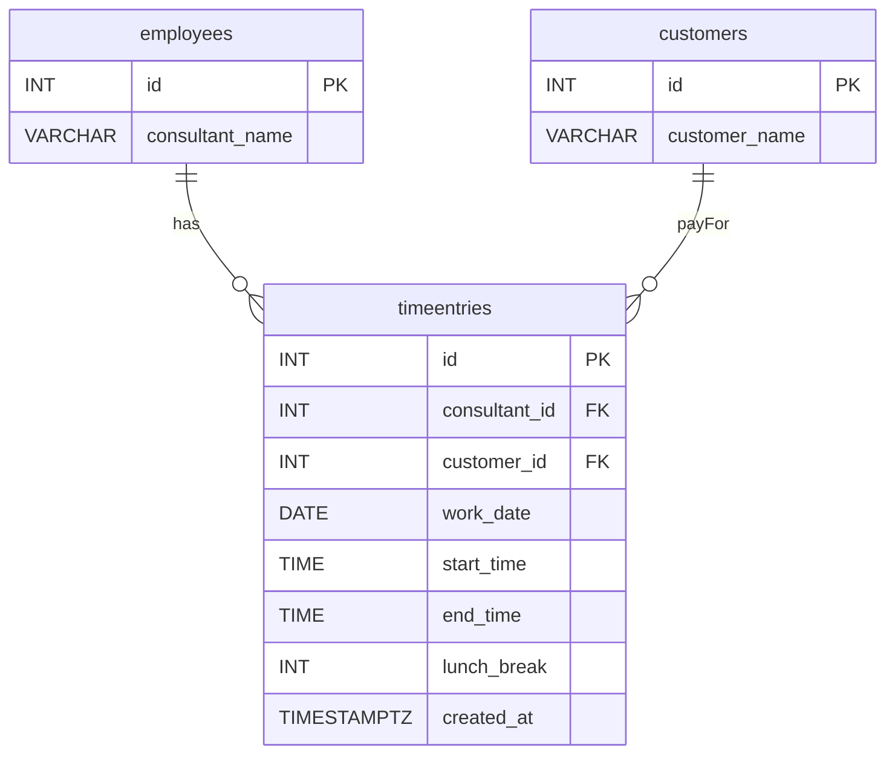

# Time Management Application

This is a simple time management application built with Python and Flask.

The consultant enters their working hours using Postman, including start time, end time, lunch break, consultant, and customer.

The application calculates the worked hours and saves the information in Azure PostgreSQL.

Azure Key Vault is used to securely store the PostgreSQL password.

## Application Flow

```text
Consultant
    ↓
Postman
    ↓
Flask REST API
    ↓
Azure Key Vault
    ↓
Gets PostgreSQL password
    ↓
Azure PostgreSQL Database
    ↓
Saves working-time information
# ⏱️Time Management Software⏱️

#### ~ by TimeTurners ~

---

A Python-based time management system for recording consultant working hours, storing time entries in PostgreSQL hosted on Azure, and generating time reports that are uploaded to Azure Blob Storage.

## 🚀 Features

- Record consultant working hours through a REST API
- Store employees, customers, and time entries in PostgreSQL
- Run PostgreSQL on Azure Database for PostgreSQL Flexible Server
- Generate time reports from stored time entries
- Upload generated reports to Azure Blob Storage
- Provision the required Azure infrastructure using an automated setup script
- Manage infrastructure configuration through environment variables

---

## 🏗️ Architecture

The project consists of two applications:

- **REST API** — accepts consultant working hours through HTTP requests and stores them in PostgreSQL.
- **Reporting Application** — reads time entries from PostgreSQL, generates a text report, and uploads the report to Azure Blob Storage.

Both applications run locally. The PostgreSQL database and Azure Blob Storage are hosted in Azure.

```text
                    ┌─────────────────────┐
                    │     REST API        │
                    │      Python         │
                    └──────────┬──────────┘
                               │
                               │ Time entries
                               ▼
                    ┌─────────────────────┐
                    │ Azure PostgreSQL    │
                    │ Flexible Server     │
                    └──────────┬──────────┘
                               │
                               │ Read time entries
                               ▼
                    ┌─────────────────────┐
                    │ Reporting           │
                    │ Application        │
                    └──────────┬──────────┘
                               │
                               │ Generated report
                               ▼
                    ┌─────────────────────┐
                    │ Azure Blob Storage  │
                    └─────────────────────┘
```

---

## 🗄️ Database

The application uses PostgreSQL to store consultants, customers, and their working hours.



---

## 📦 Prerequisites

Before setting up the project, make sure the following tools are installed:

- Python 3.x
- Git
- Azure CLI
- An active Azure subscription
- PostgreSQL client/tools, if required for local database administration

You will also need permission to create resources in the Azure subscription.

---

## 🛠️ Installation

### 1. Clone the repository

```bash
    git clone <repository-url>
    cd <repository-directory>
```

### 2. Configure Azure infrastructure

The Azure infrastructure is configured through an .env file.

Copy or create an environment file based on the provided example:

```text
infra/
├── .env
├── env_example
└── azure_setup.sh
```

Configure the required variables in infra/.env and storage_policy.json as needed.
Note: Sensitive configuration should be stored in Azure Key Vault.

### 3. Provision Azure infrastructure

From the project root, run:

```bash
./infra/azure_setup.sh
```

The setup script provisions the required Azure resources:

- Resource Group
- Key Vault
- Azure Database for PostgreSQL
- Storage account
- Storage container
- 2x VMs

Note: The script stores the Storage Account connection string and the database password as secrets in the key vault.
